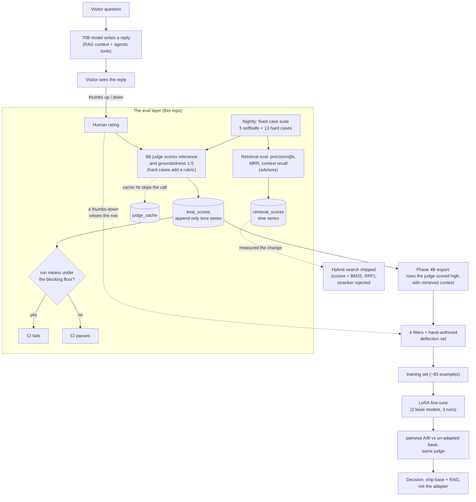

# ai-vic-eval

The evaluation methodology behind **AI-Vic**, the chatbot on
[ramirezailabs.com](https://ramirezailabs.com). It has two layers: an
LLM-as-judge that scores every reply (nightly, and on every visitor
thumbs-up/down), and a retrieval eval that scores whether the right context
came back at all. It also holds two negative results: a fine-tune the eval
said not to ship, and a reranker that made retrieval worse.

This repo is the **methodology**, not the chatbot. The chatbot itself is a
private repo (a Cloudflare Worker doing RAG + agentic tool-calling over a
hand-written corpus about one person). What's public here is the part that
generalises: how the judge is prompted, how the hard cases are written, how
retrieval is scored, how the training-data export is filtered, and what
happened when a fine-tune was trained on that data and when a reranker was
put in front of retrieval.

**Assumed background:** you know roughly what RAG and fine-tuning are. If the
retrieval-metrics basics (Recall@k, MRR) are new, start with
[rag-evaluation-lab](https://github.com/ramirez-ai-labs/rag-evaluation-lab)
first, then come back. Every acronym used here is spelled out in
[Terms](#terms) at the bottom.

## Why an eval layer at all

The chatbot's first eval was a keyword-and-retrieval check — Recall@4 for
retrieval, literal keyword matching for "groundedness." That catches gross
regressions and nothing subtle. A reply can contain every expected keyword
and still be evasive, padded, or quietly making things up.

The LLM-as-judge is the second, softer signal on top: a small model reads the
question, the same retrieved context the chatbot was given, and the reply,
then scores **relevance** and **groundedness** 1–5. Deliberately a small
model (Llama 3.1 8B class), not the 70B that writes the replies — reusing the
reply model roughly doubles the cost of every eval run and invites the model
to grade its own homework.

For two weeks it returned **5/5 on almost everything** — not because the
replies were perfect, but because every case in the suite was a softball with
solid corpus backing. Fixing that is most of what this repo documents.

It has since earned its keep a second time. A system-prompt rule written to
stop the model fabricating on out-of-corpus questions over-corrected into
refusing questions it had grounded answers for. The nightly went **red on the
regression** — mean relevance ~3.2 against a 3.5 floor — before anyone
reported it, and the fix added the matched guard cases described in
[`hard-cases/`](hard-cases/README.md).

## How the pieces fit together

The [write-up](writeup.md) is the story of the bottom branch (the export and
everything below it). The [retrieval eval](rag-eval/README.md) is the newer
part of the subgraph, and [hybrid-vs-reranker](rag-eval/hybrid-vs-reranker.md)
is what it measured first. The rest of the repo documents the judge — the
original **eval layer**.

## Contents

| Path | What |
|---|---|
| [`judge/system-prompt.md`](judge/system-prompt.md) | The judge's system prompt, verbatim, with the rationale for every clause |
| [`judge/scoring.md`](judge/scoring.md) | The two dimensions, the small-model choice, the exact-match score cache (and why it's keyed on `(query, reply)`), the append-only time series vs. the cache, and the CI blocking floor |
| [`hard-cases/README.md`](hard-cases/README.md) | The 13 `hard-*` cases — questions with no clean corpus answer, or a subtle failure mode, where a fluent confident answer is the *wrong* answer — each with its per-question rubric and the failure it caught. Cases 8–11 are a matched pair added after a fix for one failure mode (fabrication) created another (over-cautious deflection) — the nightly caught the over-correction on its own. Cases 12–13 are precision traps about a named project; one caught a real misstatement |
| [`training-export/filters.md`](training-export/filters.md) | The four filters that turn judge-approved rows into a clean fine-tuning set, and why a naive "score ≥ 4" query produces garbage |
| [`rag-eval/README.md`](rag-eval/README.md) | The retrieval eval: context precision@k, MRR and context recall over labelled cases, the inverted out-of-corpus check, and what three weeks of nightlies showed |
| [`rag-eval/hybrid-vs-reranker.md`](rag-eval/hybrid-vs-reranker.md) | **"The reranker made retrieval worse. Hybrid search shipped instead."** Every variant measured, why the untuned version shipped, and the batching bug that briefly made the results look better than they were |
| [`rag-eval/hybrid-reference.ts`](rag-eval/hybrid-reference.ts) | The shipped hybrid ranking (BM25 + Reciprocal Rank Fusion), self-contained and type-checked in CI |
| [`scorecard-sample.md`](scorecard-sample.md) | A representative nightly scorecard — the 1.9-to-5.0 spread that means the judge is measuring something |
| [`writeup.md`](writeup.md) | **"I fine-tuned a model for my portfolio chatbot. My own eval told me not to ship it."** The full negative-result narrative |

**New here?** Read [`writeup.md`](writeup.md) first — it's the whole story
start to finish. Then [`judge/system-prompt.md`](judge/system-prompt.md) and
[`hard-cases/README.md`](hard-cases/README.md) for how the judge actually
works, and [`scorecard-sample.md`](scorecard-sample.md) to see it scoring.
For retrieval, read [`rag-eval/README.md`](rag-eval/README.md), then
[`rag-eval/hybrid-vs-reranker.md`](rag-eval/hybrid-vs-reranker.md).

## The one-paragraph version of the write-up

The fine-tuning phase (Phase 4B in the chatbot's internal roadmap — the eval
layer itself is Phase 4A) was going to fine-tune a small LoRA adapter on the
judge's high-scoring output — "built and evaluated my own LLM" is a strong
portfolio signal, and a 7B + adapter is ~10× cheaper to run than a 70B. The
adapter regressed against the un-adapted base on every run, across two base
models. Root cause: the judge rewards direct, confident answers, so the
high-scoring training pool skewed ~90% "confident first-person assertion" —
and supervised fine-tuning (SFT) on that teaches the model to *always*
assert, so it fabricated specifics on questions the corpus doesn't cover. The
base model + retrieval + a well-written system prompt was already better. So
it wasn't shipped. The adapter stays on Hugging Face
([`VHRamirez/victor-ramirez-7b-lora`](https://huggingface.co/VHRamirez/victor-ramirez-7b-lora))
as the documented artifact of the experiment.

## Terms

| Term | What it means here |
|---|---|
| **RAG** | Retrieval-Augmented Generation — before the model answers, a retriever pulls relevant chunks from the corpus and pastes them into the prompt as "background context." |
| **LLM-as-judge** | Using a second language model to score the first model's output, instead of a keyword or exact-match check. |
| **relevance / groundedness** | The judge's two axes. Relevance: does the answer address the question asked? Groundedness: is every factual claim supported by the retrieved context? |
| **Recall@k / MRR** | Retrieval metrics. Recall@k: did a right chunk land in the top *k* results? MRR: mean reciprocal rank of the first relevant chunk (1.0 at rank 1, 0.5 at rank 2). See [rag-evaluation-lab](https://github.com/ramirez-ai-labs/rag-evaluation-lab). |
| **context precision / context recall** | Ragas-style retrieval metrics. Precision: are the right chunks ranked near the *top*? Recall: does the retrieved context contain every claim a correct answer needs (checked by the small judge against a reference answer)? |
| **cosine / embedding search** | Ranking chunks by the similarity between the question's embedding vector and each chunk's. Good at meaning, weak on exact words like names and acronyms. |
| **BM25** | The classic keyword-search scoring formula. Good at exact words, blind to meaning. |
| **hybrid search / RRF** | Running cosine and BM25 together and merging the two rankings with Reciprocal Rank Fusion: each chunk scores 1 / (60 + its rank) in each list, summed. |
| **cross-encoder reranker** | A model that reads the question and each candidate chunk *together* and rescores them. The textbook second retrieval stage; [here it made things worse](rag-eval/hybrid-vs-reranker.md). |
| **SFT** | Supervised Fine-Tuning — training on `(prompt, good answer)` pairs. Can only demonstrate good answers; structurally can't teach "don't do X." |
| **LoRA** | Low-Rank Adaptation — freeze the base model, train a small set of add-on weights (here ~16 MB). Cheap to train and to serve. |
| **DPO** | Direct Preference Optimization — trains on `(prompt, chosen, rejected)` triples, so it *can* learn to prefer one behaviour over another. The proposed next step, not yet done. |
| **BPE** | Byte-Pair Encoding — a common tokenizer algorithm that splits text into sub-word units. |
| **the corpus** | The private, hand-written body of text about one person that the chatbot retrieves from. Not in this repo. |
| **the judge / the reply model** | The 8B model that scores (judge) vs the 70B model that writes visitor-facing answers (reply model). |

## Related

- [rag-evaluation-lab](https://github.com/ramirez-ai-labs/rag-evaluation-lab) — a beginner-friendly walk through retrieval metrics (Recall@k, Precision@k, MRR)
- [Medium: RAG Evaluation series](https://medium.com/@vhr1975) — Fundamentals Without the Cloud → embedding-quality benchmarks → the retriever decision framework

## License

MIT — see [LICENSE](LICENSE).
